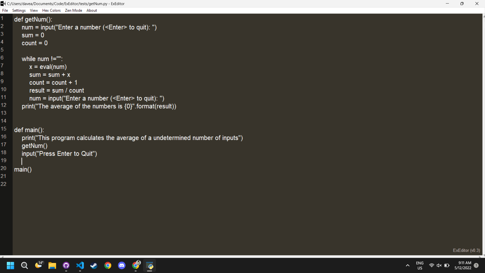
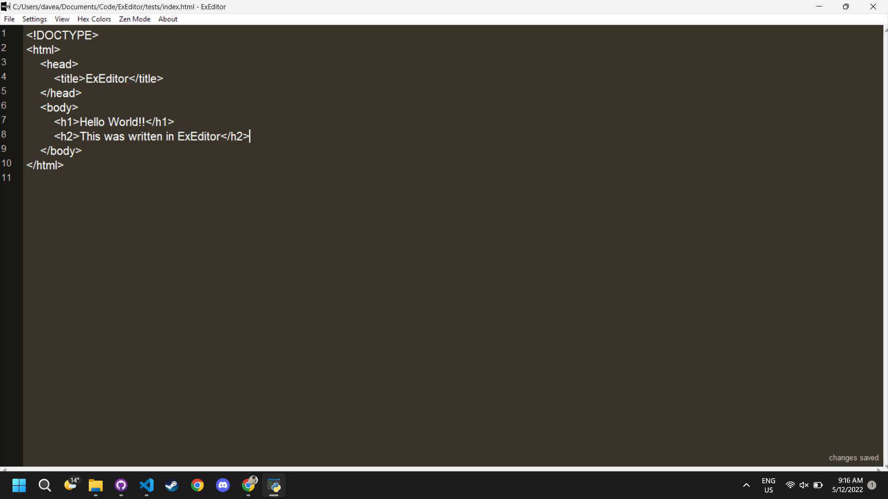

  
  
  <h1 align="center">ExEditor</h1>
  

  
  
  
  
  

  

    A IDE that tries to give the user the best working environment
     
    <a href="">Explore Website</a>
    ·
    <a href="">Download ExEditor</a>
  

___

# Preview Screenshots

  
  

___

# Keyboard Shortcuts
ExEditor has shortcuts for most commonly performed actions. The list of all the shortcuts is presented bellow:

| Command | KeyBinding | Description |
| ------- | ---------- | ----------- |
| Copy | <kbd>ctrl</kbd>+<kbd>c</kbd> | Copy selected text |
| Cut | <kbd>ctrl</kbd>+<kbd>x</kbd> | Cut selected text |
| Paste | <kbd>ctrl</kbd>+<kbd>v</kbd> | Paste text from the clipboard |
| Bold | <kbd>ctrl</kbd>+<kbd>b</kbd> | Bold selected text |
| Highlight | <kbd>ctrl</kbd>+<kbd>g</kbg> | Highlight selected text |
| New File | <kbd>ctrl</kbd>+<kbd>n</kbd> | Open a new empty file |
| Open File | <kbd>ctrl</kbd>+<kbd>o</kbd> | Open an existing file |
| Run File | <kbd>ctrl</kbd>+<kbd>r</kbd> | Run the currently active file (Doesn't work) |
| Save | <kbd>ctrl</kbd>+<kbd>s</kbd> | Save the currently active file |
| Save As | <kbd>ctrl</kbd>+<kbd>shift</kbd>+<kbd>s</kbd> | Save the currently active file under a different name |